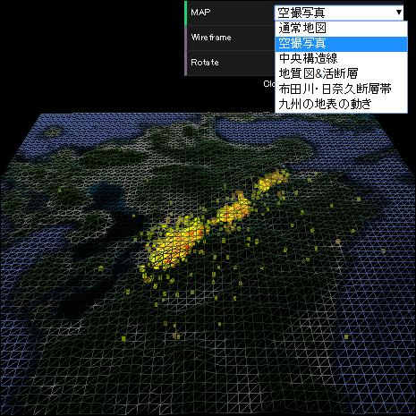
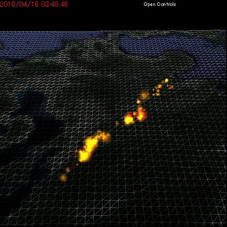
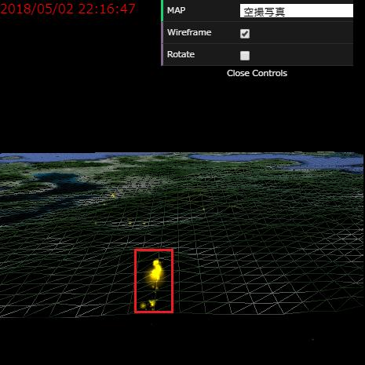
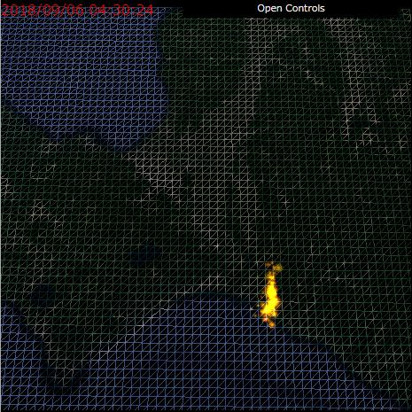
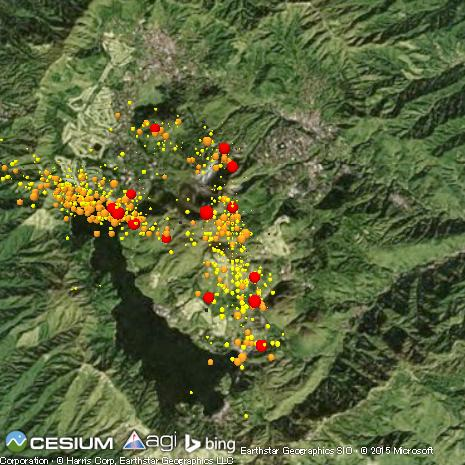
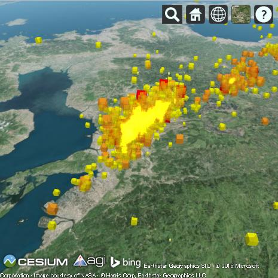
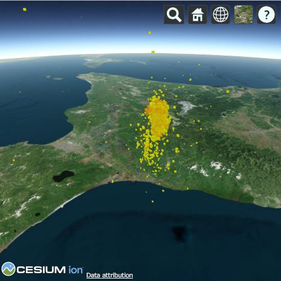
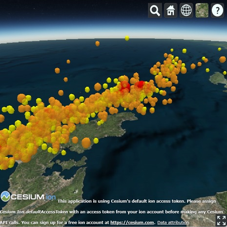

# webgl-quake-examples
WebGL Quake Examples

# 震度データ可視化サンプル

## three.js サンプル

### 熊本地震（2016年）

### 熊本地震（2016年）（震度データ１カ月分をアニメーション表示）

### 新燃岳 火山性地震（2018年）

### 北海道地震（2018年）

## Cesium.js サンプル

### 箱根周辺 地震活動（2015年）

### 熊本地震（2016年）

### 北海道地震（2018年）

### 能登半島地震（2024年）

